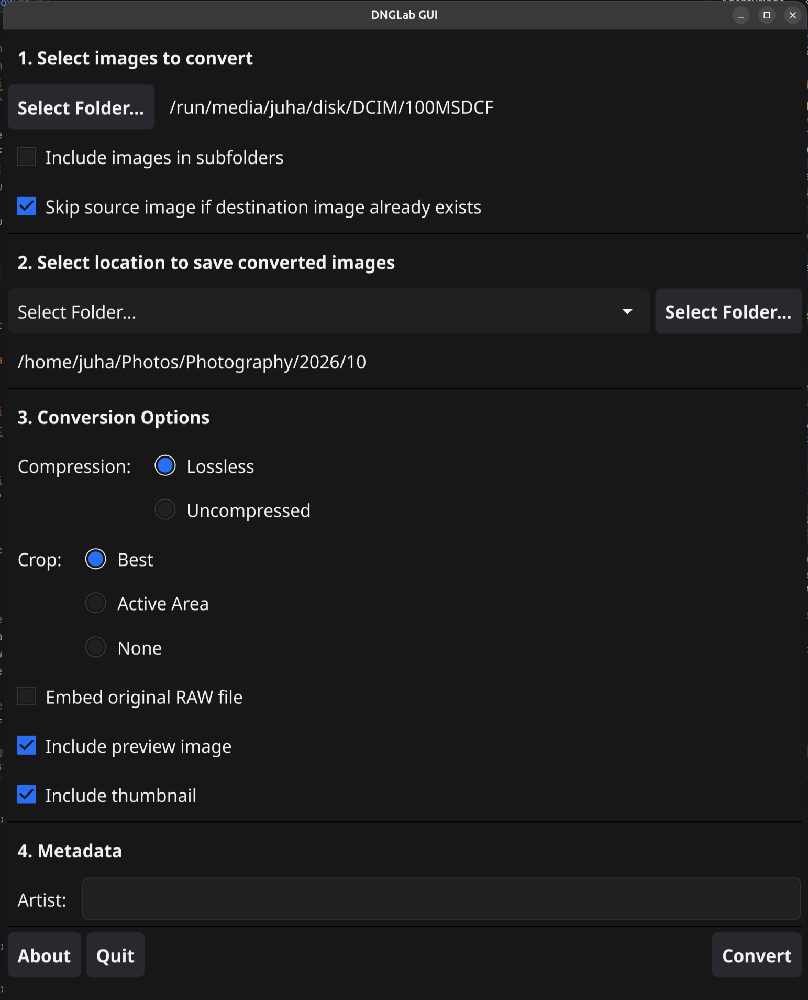
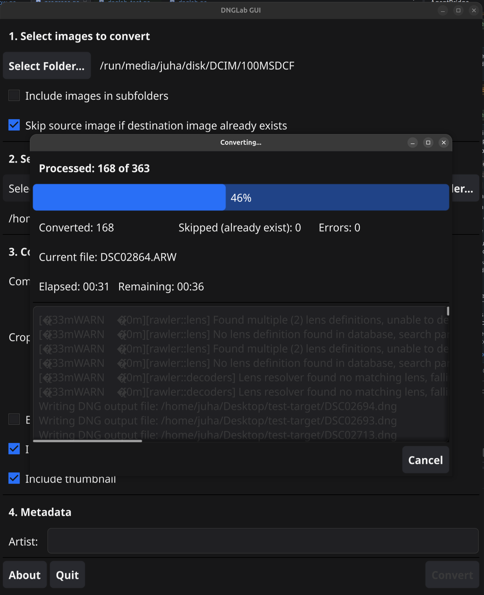
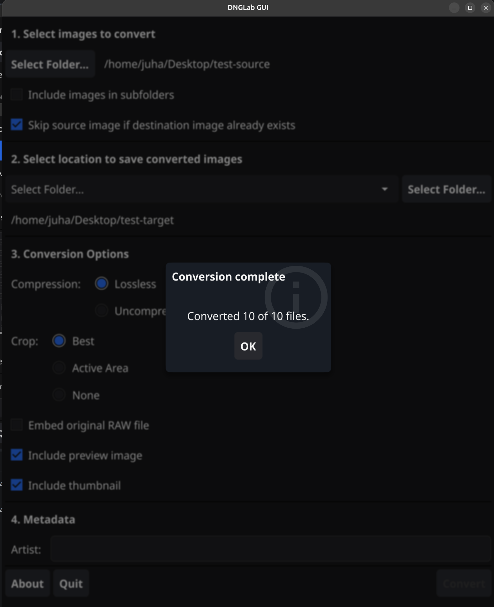

# DNGLab GUI

[](https://github.com/strobotti/dnglab-gui/actions/workflows/ci.yml)

A graphical user interface for dnglab — converts camera RAW files to Adobe DNG format.

## Prerequisites

- **Go 1.27.1 or later** — [https://go.dev/dl/](https://go.dev/dl/)
- **C compiler** — required by the [Fyne](https://fyne.io/) UI toolkit:
    - Linux: `gcc` (e.g. `sudo apt install gcc` on Debian/Ubuntu)
    - macOS: Xcode Command Line Tools (`xcode-select --install`)
- **zenity** (Linux only) — used for the native folder picker, so that removable media such as SD cards show up in the
  dialog (e.g. `sudo apt install zenity`). If zenity is not installed, the application falls back to a built-in folder
  browser, which does not show removable media.
- **dnglab CLI** — [https://github.com/dnglab/dnglab](https://github.com/dnglab/dnglab)

  The application searches for the `dnglab` binary in this order:
    1. The same directory as the `dnglab-gui` binary
    2. The system `PATH`

## Releases

Releases are automated using [release-please](https://github.com/googleapis/release-please). When commits following
the [Conventional Commits](https://www.conventionalcommits.org/) format are pushed to the `main` branch, release-please
automatically creates a release pull request. When that PR is merged, a new GitHub Release is created with pre-built
binaries.

**Download pre-built binaries** from the [GitHub Releases](https://github.com/strobotti/dnglab-gui/releases) page.
Available platforms:

- Linux (amd64)
- macOS (amd64)
- macOS (arm64/Apple Silicon)

## Build

CI automatically builds and tests the project on every push and pull request. You can also build locally:

```sh
go build -o dnglab-gui ./cmd/dnglab-gui
```

On Linux, `make build-linux` builds `bin/dnglab-gui-linux-amd64`.

## Run

Development (no prior build required):

```sh
go run ./cmd/dnglab-gui
```

After building:

```sh
./dnglab-gui
```

## Usage



The main window is divided into four sections:

### 1 Select images to convert

Pick a source folder containing RAW files with **Select Folder...**. The folder picker is the system file dialog, so you
can resize it, and it lists mounted removable media such as SD cards.

- **Include images in subfolders** — scan the source folder recursively.
- **Skip source image if destination image already exists** — leave out files whose `.dng` already exists in the output
  location instead of overwriting them.

The **Convert** button is enabled once a source folder is selected. After a conversion finishes, it is disabled again
until a setting changes, so an unchanged run cannot be started by accident. If some files failed, it stays enabled so
you can retry.

### 2 Select location to save converted images

Choose where the DNG files are written. By default the converted files are saved to the same folder as the originals.
Select a different output folder when you want to keep originals and conversions separate.

### 3 Conversion Options

| Option      | Values                           |
|-------------|----------------------------------|
| Compression | Lossless (default), Uncompressed |
| Crop mode   | Best crop, Active area, None     |
| Embed RAW   | On / Off                         |
| Preview     | On / Off                         |
| Thumbnail   | On / Off                         |

### 4 Metadata

- **Artist** — written into the `Artist` DNG metadata field.

### Conversion progress

While converting, a progress window shows:

- the number of files processed out of the total, with a progress bar
- how many files were converted, skipped (already existed) and failed
- the file currently being processed
- the elapsed time and an estimate of the remaining time
- dnglab's log output, and a **Cancel** button



### Results

When the run finishes, a summary is shown. If any files were skipped or failed, the summary lists the failed files with
their reasons in a scrollable list. Skipped files are counted, but not listed.



## Supported RAW Formats

| Manufacturer      | Extensions                                            |
|-------------------|-------------------------------------------------------|
| Canon             | CR3, CR2, CRW                                         |
| Nikon             | NEF, NRW                                              |
| Sony              | ARW, SRF, SR2                                         |
| Fujifilm          | RAF                                                   |
| Panasonic / Leica | RW2                                                   |
| Olympus           | ORF                                                   |
| Pentax / Ricoh    | PEF                                                   |
| Others            | 3FR, ARI, ERF, KDC, DCS, DCR, IIQ, MOS, MEF, MRW, SRW |

The actual list of supported formats depends on the version of `dnglab` installed on your system.

## Contributing

Contributions are welcome! This project uses [Conventional Commits](https://www.conventionalcommits.org/) to automate
versioning and changelog generation. Please format your commit messages as follows:

| Prefix      | Purpose                  | Version bump |
|-------------|--------------------------|--------------|
| `feat:`     | New feature              | Minor        |
| `fix:`      | Bug fix                  | Patch        |
| `docs:`     | Documentation only       | Patch        |
| `chore:`    | Maintenance (no release) | None         |
| `refactor:` | Code refactoring         | Patch        |

Examples:

- `feat: add batch processing support`
- `fix: handle missing dnglab binary gracefully`
- `docs: update installation instructions`

## License

MIT License — Copyright 2026 Juha Jantunen
